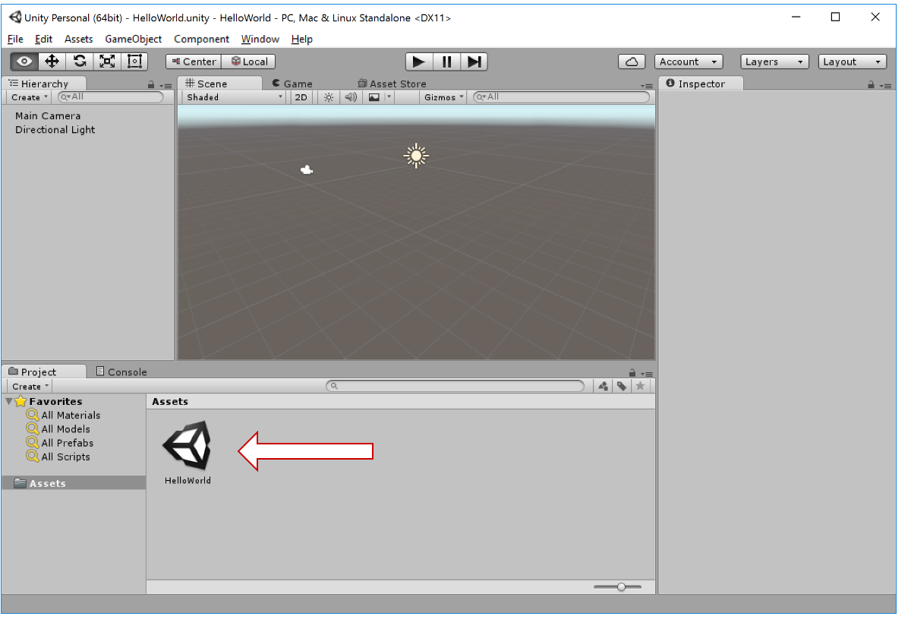

### Steps

The default project template creates an unsaved empty scene, so save it first. File -> Save Scene



Create a new script from the menu; Assets -> Create -> C# Script (or) Right click on Assets in Project View -> Create -> C# Script

```csharp
using UnityEngine;
using System.Collections;

public class HelloWorld : MonoBehaviour {

	// Use this for initialization
	void Start () {
	
	}
	
	// Update is called once per frame
	void Update () {
	
	}
}
```

The *Start()* method is called when the object becomes active which is when the level with that object is loaded.

The *Update()* method is called for every frame.

Create an Empty Game Object; GameObject -> Create Empty. The newly created GameObject shows up in the Hierarchy View.


Attach the newly created script to the empty Game Object, by dragging it and dropping it on the Game Object in the Hierarchy View.

Notice how the script is displayed as an attached component in the inspector view for the game object.


```csharp
using UnityEngine;
using System.Collections;

public class HelloWorld : MonoBehaviour {

	// Use this for initialization
	void Start () {
		Debug.Log("Obligatory Hello World!");
	}
	
	// Update is called once per frame
	void Update () {
	
	}
}
```

Press play in Unity and look at the Console view.
