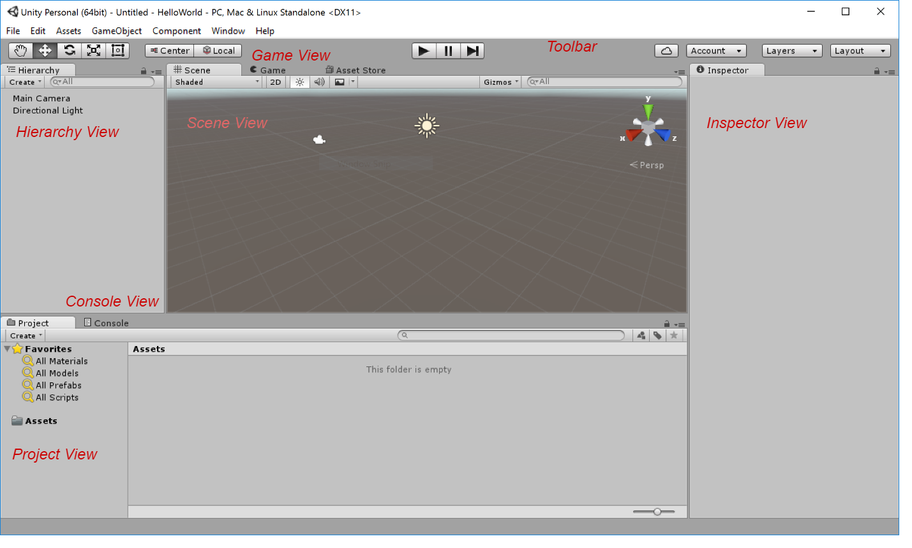
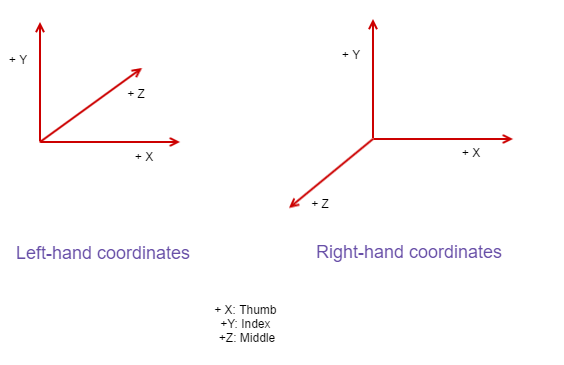

### Features

1. Dynamic Shadows
2. Normal Maps
3. Physics Simulations
4. Screen Space Ambient Occlusion (SSAO)
5. Cross Platform Support (Mac, Windows, iPhone, Android, WebGL, XBox, PlayStation)
6. Visual Editor which can be customized by scripts
7. Embraces modular component system, which prefers composition to inheritance, to build game objects

### Components of Unity's UI

**Scene View**: displays the game world where objects can be interacted with. The scene view is interactive even when the game is running, allowing the objects to be inspected for debugging purposes.

**Game View**: is a tab located next to the *Scene View* tab, which is displayed automatically when a game is run. It displays the currently running game.

**Hieararchy View**: displays objects in the scene and their relationship hierarchies as a list view.

**Inspector View**: displays information about the currently selected object, which includes details about a list of components attached to the selected object. 
All objects have a Transform component, which deals with position/orientation/scaling of that object. 
Scripts that inherit from *MonoBehaviour* are treated as components and can be attached to game objects.

**Project View**: displays all the files in the project, which include assets like art assets and code. 
The left panel displays a list of directories which when selected displays their contents in the right panel.
The conents displayed are a mirror of what exists in the filesystem. 

**Console View**: is where messages from programs are displayed.

**Toolbar**: contains buttons to the left for exploring the scene

### Basics

Visual Editor : art assets can be laid out in this editor. 

The assets can be controlled by scripts. 

Scripting is done in MonoDevelop. Scripts are attached to objects as components.

Unity added *#pragma strict* to enforce 

Scripts, that contain code, are attached to objects in the scene.

A game object can have a component collection attached to it, which can include scripts to execute. 

Game objects are 

The Unity game engine executes the script code.

### MonoBehaviour

A script is a component only if it inherits from *MonoBehaviour* and only components can be attached to game objects. *MonoBehaviour* does the heavylifting of attaching components to 
the game objects.

Each script generally contains a class and "attaching" a script (a component script) to a game object is similar to associating an instance of that class to that object.
 
The following methods of *MonoBehaviour* could be overridden to provide custom behavior

1. Start()
2. Update()

The *Start()* method is called when the object becomes active which is when the level with that object is loaded.

The *Update()* method is called for every frame.

### Left-hand Coordinates vs Right-hand Coordinates

